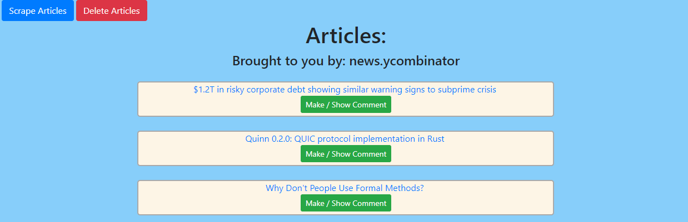
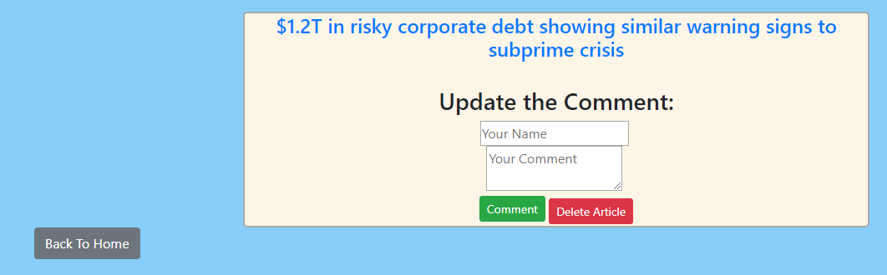

# News Scraper
 
Title: Article Scraper 
Developer: Kevin Flerlage 
Deployment Date: 01/21/2019 
For: Northwestern Coding Bootcamp 

## **Description**

News scraper is an app which goes to news.ycombinator and pulls all the articles and links from there. This stores the articles it grabs in a Mongo database. This app was an intro to both web scraping and an intro to MongoDB.  

## **Demo**

 

This website has a very simple layout and application. To get new articles to populate into the database click the "Scrape Articles" button at the top. This will then go to news.ycombinator and pull all the articles that are currently displayed on the screen. If an article already exists in the database it will be skipped over. 

All the links to the articles are stored in Mongo as well. Click on the title to be taken directly to the link 

To delete all the articles from the database press the "Delete Articles" button. 

Both of these buttons will refresh the page once the data is pulled or deleted. 

### **Comment**

To make a comment on an article which will be stored first click the "Make / Show Comment" button below each article title. 

 

This will bring you to the page for editing a comment on the article the user has chosen. 

 

On the site to enter a comment the user must fill out the name and the comment field. When filling out this field and pressing the "Comment" button that info is stored to the database and references the article. Once the comment is saved the page refreshes to show the new comment which was inputted. The user can add as many comments to the article as they wish. However, only the last article added will be shown. 

From here the user can also delete the article. If clicked this will purge the specific article from the database and then send the user back to the homepage.

## **Reflection**

This assignment was a great gateway into MongoDB/Mongoose. This assignment also helped me further my ability in making ajax requests and ensuring asynchronous code flows in the intended manner. One of the struggles with this assignment was getting the pages to reload or redirect at the correct time, after the database was updated. Going forward the biggest thing to improve on this site would be the UI. Right now this is too minimal and not good looking. Additionally, it would be good to have users login and make comments to the article which others could then look at and reply to.